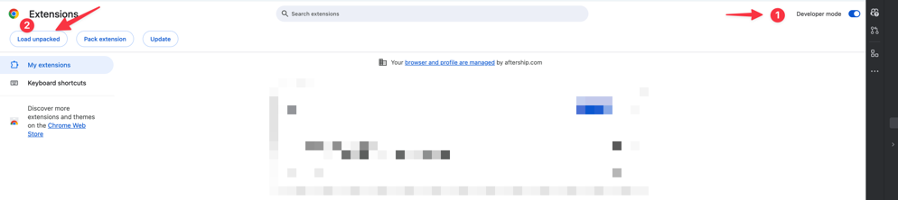

# google-meet-auto-mute
A Chrome plugin that automatically mutes the microphone and camera when you join a Google Meeting.

## How to install this extension
1. Download the source code from this repository.
2. Open Chrome and go to `chrome://extensions/`.
3. Enable "Developer mode" in the top right corner.
4. Click on "Load unpacked" and select the folder where you downloaded the source code.
5. The extension should now be installed and active.
6. To test the extension, join a Google Meet meeting. The extension should automatically mute your microphone and camera.
7. To disable the extension, go back to `chrome://extensions/` and toggle the switch next to the extension name.

